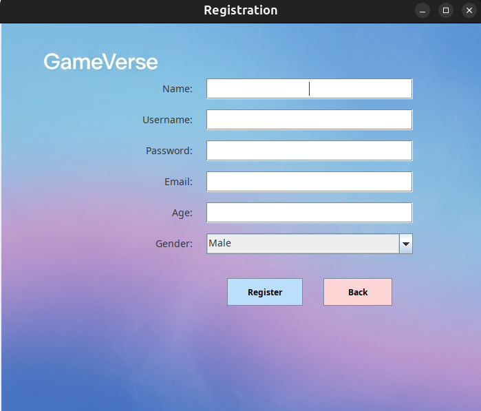
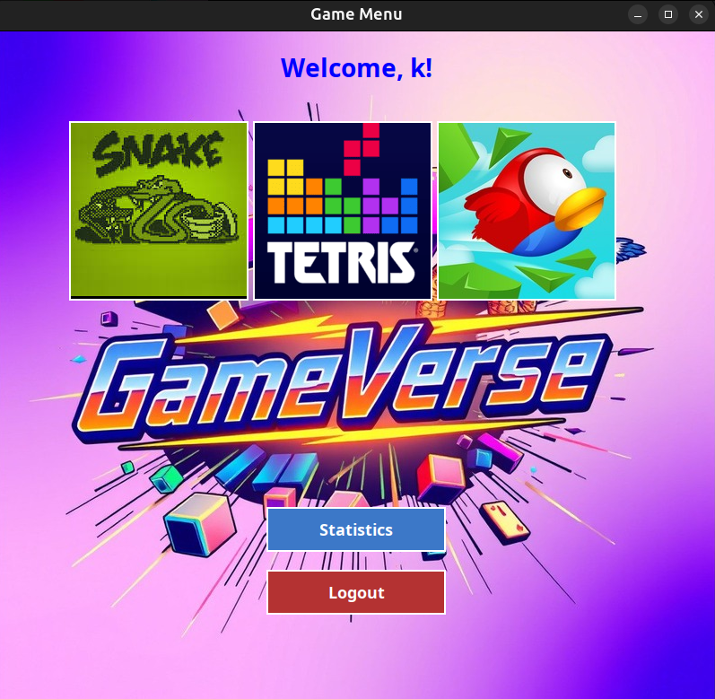
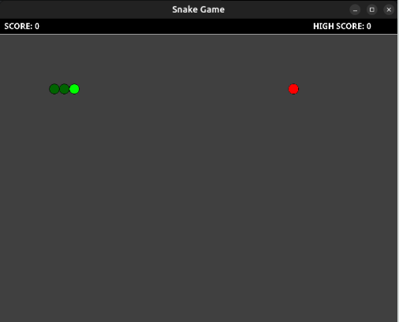
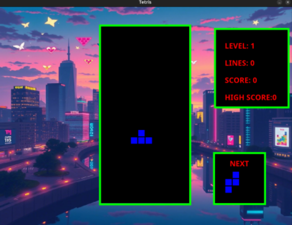
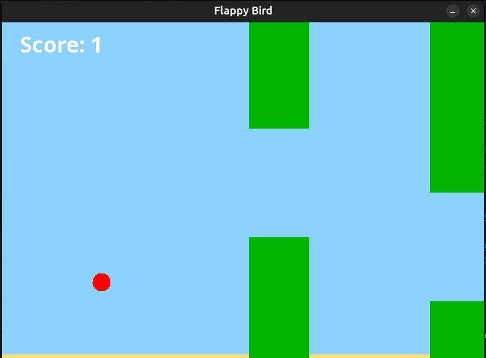
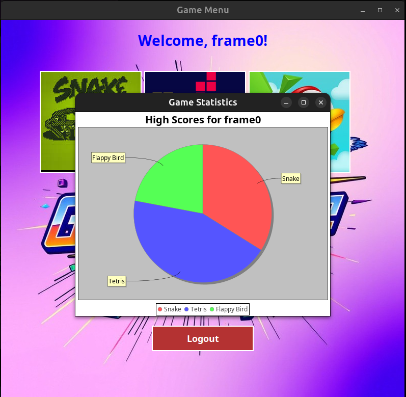

# 🎮 GameVerse: Java Classics

**GameVerse** is a Java-based desktop application featuring three timeless arcade games: **Snake**, **Tetris**, and **Flappy Bird** — all built using **Java Swing** for the UI and connected with a **XAMPP (MySQL)** backend to store player scores, profiles, and other data.

> 📍 Academic project developed as part of our Java coursework, demonstrating skills in GUI programming, OOP design, and database integration.

---

## 🧩 Features

- 🎮 Play **three classic games** with intuitive keyboard controls.
- 👤 Simple GameVerseManager.login/signup system connected to **MySQL** via XAMPP.
- 🏆 Score tracking and leaderboard system for each game.
- 📊 Visual game stats (charts/graphs using JFreeChart).
- 💾 Persistent storage of user data using JDBC.

---

## 🖼️ Games Included

| Game         | Description                                  
|--------------|----------------------------------------------
| 🐍 Snake     | Classic arcade Snake game with speed control 
| 🧱 Tetris    | Stack the blocks, clear lines, and score!    
| 🐦 Flappy Bird | Tap to fly and avoid pipes!                 

---

## 🛠️ Tech Stack

- **Java** (JDK 8+)
- **Swing** (GUI Framework)
- **XAMPP** (Apache + MySQL)
- **JDBC** (Java Database Connectivity)
- **JFreeChart** (for visual score/statistics)
- **Maven** (optional for dependency management)

---

## 🚀 How to Run Locally

1. **Clone the repository**:
   ```bash
   git clone https://github.com/shihab-3point14/GameVerse-Java-Classics.git
   cd GameVerse-Java-Classics
2. **Set up XAMPP**:

- Install and run XAMPP.

- Import the included gameverse.sql file into phpMyAdmin to create the database.

3. **Configure JDBC**:

- Update the database credentials in your Java code (usually found in a DBConnection.java or similar file).

4. **Compile and Run**:
   
- Open in your IDE (NetBeans, IntelliJ, Eclipse).

- Build and run Main.java or the launcher class.

---
   
## 📂 Project Structure

- Open in your IDE (NetBeans, IntelliJ, Eclipse).

- Build and run Main.java or the launcher class.
```graphql
GameVerse-Java-Classics/
├── ClassicalSnake/
├── FlappyBird/
├── Tetris/
├── DataBase/              # SQL file and DB logic
├── GameVerseManager       # Manage, Images, sounds etc.
├── Main.java              # Entry point
└── README.md
```

---

## 📸 Screenshots

🖼️ Login/Register Interface




🎮 Game Menu



🐍 Classical Snake



🧱 Tetris 



🐦 Flappy Bird



📊 Score Chart 



---

## 📜 License

This project is open source and available under the MIT License.
Feel free to fork, improve, and build on it for learning purposes!

---

## 📫 Contact

Have questions or feedback? Reach out via GitHub Issues or email.
